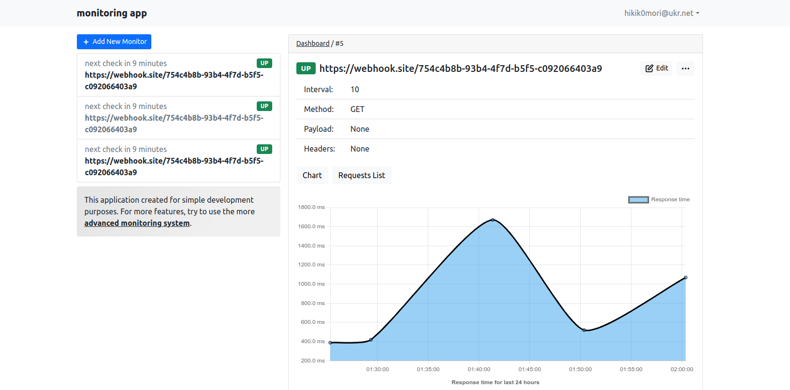

## Monitoring app

#### A web application for monitoring clients' web resources



In this application, you can create a monitoring task that will check the availability of a web resource at the 
specified url address and make resource response time statistics.

Implemented features:

- [x] Support for get, push, options requests
- [x] Response time statistic
- [ ] Custom headers
- [ ] Custom payloads
- [ ] Support for streaming
- [ ] Notifications
- [ ] Production configuration

---

## Installation

### install dependencies

```shell
python -m venv venv
source ./venv/bin/activate
python -m pip install -r requirements.txt
```

### setup environment variables

```shell
cat .env.example
mv .env.example .env.development
source .env.development
```

### start redis & postgresql via docker-compose

```shell
docker-compose --env-file=.env.development up --build
```

### run celery worker

```shell
source .env.development
celery -A src.worker:celery_app worker -P eventlet -c 100 -l DEBUG
```

### run celery beat

```shell
source .env.development
celery -A src.worker:celery_app beat -l INFO
```

### run flask app
```shell
source .env.development
flask run
```